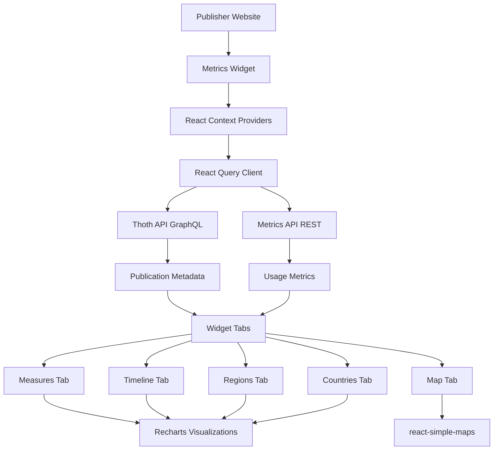

# Metrics Widget

A React-based widget for displaying publication metrics from multiple platforms. Designed for publishers to easily embed comprehensive usage statistics for their publications identified by DOI.

## Features

- 📊 **Multiple Visualization Tabs**: Measures, Timeline, Map, Regions, and Countries
- 🗺️ **Geographic Distribution**: Interactive world map showing global reach
- 📈 **Time-based Analytics**: Track metrics over time with customizable date ranges
- 🎨 **Fully Customizable**: Override styles with CSS custom properties
- 📱 **Responsive Design**: Works seamlessly on mobile, tablet, and desktop
- 🔌 **Easy Integration**: Works with React or JavaScript projects

## Installation

### For React Projects

```bash
npm install metrics-widget
```

### For Vanilla JavaScript Projects

#### Option 1: NPM Install (with bundler)

```bash
npm install metrics-widget
```

#### Option 2: CDN (no bundler required)

```html
<!-- CSS -->
<link rel="stylesheet" href="https://unpkg.com/metrics-widget@latest/dist/metrics-widget.css">

<!-- Import map for React dependencies -->
<script type="importmap">
  {
    "imports": {
      "react": "https://esm.sh/react@19",
      "react-dom": "https://esm.sh/react-dom@19",
      "react-dom/client": "https://esm.sh/react-dom@19/client",
      "react/jsx-runtime": "https://esm.sh/react@19/jsx-runtime"
    }
  }
</script>

<!-- Widget script -->
<script type="module">
  import { initMetricsWidget } from 'https://unpkg.com/metrics-widget@latest/dist/metrics-widget.js';
  // Use widget here
</script>
```

## Quick Start

### React Implementation

```tsx
import { MetricsWidget } from 'metrics-widget';
import 'metrics-widget/dist/metrics-widget.css';

function App() {
  return (
    <div>
      <h1>Publication Metrics</h1>
      <MetricsWidget doi="10.11647/OBP.0159" />
    </div>
  );
}

export default App;
```

### Vanilla JavaScript Implementation

#### With Bundler (Webpack, Vite, etc.)

```html
<!DOCTYPE html>
<html lang="en">
<head>
  <meta charset="UTF-8">
  <meta name="viewport" content="width=device-width, initial-scale=1.0">
  <title>Metrics Widget Demo</title>
  <link rel="stylesheet" href="node_modules/metrics-widget/dist/metrics-widget.css">
</head>
<body>
  <div id="metrics-container"></div>
  
  <script type="module">
    import { initMetricsWidget } from './node_modules/metrics-widget/dist/metrics-widget.js';
    
    // Initialize the widget
    const widget = initMetricsWidget('metrics-container', '10.11647/OBP.0159');
    
    // Cleanup when needed
    // widget.unmount();
  </script>
</body>
</html>
```

#### Without Bundler (CDN + Import Maps)

For environments without a build tool, use import maps to load React from CDN:

```html
<!DOCTYPE html>
<html lang="en">
<head>
  <meta charset="UTF-8">
  <meta name="viewport" content="width=device-width, initial-scale=1.0">
  <title>Metrics Widget Demo</title>
  
  <!-- Load the widget CSS -->
  <link rel="stylesheet" href="https://unpkg.com/metrics-widget@latest/dist/metrics-widget.css">
  
  <!-- Import map for React dependencies from CDN -->
  <script type="importmap">
    {
      "imports": {
        "react": "https://esm.sh/react@19",
        "react-dom": "https://esm.sh/react-dom@19",
        "react-dom/client": "https://esm.sh/react-dom@19/client",
        "react/jsx-runtime": "https://esm.sh/react@19/jsx-runtime"
      }
    }
  </script>
</head>
<body>
  <h1>Publication Metrics</h1>
  <div id="app"></div>
  
  <!-- Initialize widget using ES modules -->
  <script type="module">
    import { initMetricsWidget } from 'https://unpkg.com/metrics-widget@latest/dist/metrics-widget.js';
    
    // Initialize the widget
    const widget = initMetricsWidget('app', 'https://doi.org/10.11647/OBP.0159');
    
    console.log('Widget initialized:', widget);
    
    // Cleanup when needed
    // widget.unmount();
  </script>
</body>
</html>
```

**Note**: Import maps are supported in all modern browsers (Chrome 89+, Firefox 108+, Safari 16.4+, Edge 89+). For older browsers, use a bundler or polyfill.

## API Reference

### React Component

#### Props

```typescript
interface MetricsWidgetProps {
  doi: string; // DOI identifier (with or without https://doi.org/ prefix)
}
```

**Example DOI formats:**
- `"10.11647/OBP.0159"`
- `"https://doi.org/10.11647/OBP.0159"`

### JavaScript API

#### `initMetricsWidget(containerId, doi)`

Initializes the metrics widget in the specified container.

**Parameters:**
- `containerId` (string): The ID of the DOM element to render the widget in
- `doi` (string): The DOI identifier for the publication

**Returns:**
```typescript
interface MetricsWidgetInstance {
  unmount: () => void; // Cleanup function to remove the widget
}
```

**Example:**

```javascript
const widget = initMetricsWidget('app', '10.11647/OBP.0159');

// Later, to remove the widget
widget.unmount();
```

## Environment Configuration

The widget connects to two APIs for fetching data. You can configure these endpoints using environment variables:

### Environment Variables

Create a `.env` file in your project root:

```env
VITE_THOTH_API_URL=https://api.thoth.pub/graphql
VITE_METRICS_API_URL=https://metrics-api.operas-eu.org
```

**Default values:**
- `VITE_THOTH_API_URL`: `https://api.thoth.pub/graphql` (publication metadata)
- `VITE_METRICS_API_URL`: `https://metrics-api.operas-eu.org` (usage metrics)

### Using with Different Build Tools

#### Vite

Create `.env` file in your project root (shown above). Vite automatically loads it.

#### Create React App

```env
REACT_APP_THOTH_API_URL=https://api.thoth.pub/graphql
REACT_APP_METRICS_API_URL=https://metrics-api.operas-eu.org
```

Note: You'll need to update the widget's config to read from `REACT_APP_*` instead of `VITE_*` variables.

#### Webpack

Use `webpack.DefinePlugin` or `dotenv-webpack`:

```javascript
// webpack.config.js
const webpack = require('webpack');

module.exports = {
  plugins: [
    new webpack.DefinePlugin({
      'import.meta.env.VITE_THOTH_API_URL': JSON.stringify(process.env.THOTH_API_URL),
      'import.meta.env.VITE_METRICS_API_URL': JSON.stringify(process.env.METRICS_API_URL)
    })
  ]
};
```

## Customization

### Styling with CSS Custom Properties

The widget uses CSS custom properties (CSS variables) for all styling, making it easy to match your brand.

#### Basic Color Customization

```css
:root {
  /* Primary colors */
  --color-background: #fff9e6;
  --color-typography: #000000;
  
  /* Accent colors */
  --purple: hsl(276, 26%, 50%);
  --purple-light: hsl(284, 36%, 59%);
  --yellow: hsl(39, 100%, 93%);
}
```

#### Chart Colors

Customize the color scheme for different platforms:

```css
:root {
  /* Countries/Regions chart gradient (from darkest to lightest) */
  --color-countries-1: hsl(284, 54%, 14%);
  --color-countries-2: hsl(284, 36%, 28%);
  --color-countries-3: hsl(284, 26%, 41%);
  --color-countries-4: hsl(284, 27%, 49%);
  --color-countries-5: hsl(284, 36%, 59%);
  --color-countries-6: hsl(284, 47%, 67%);
  --color-countries-7: hsl(284, 67%, 76%);
  --color-countries-8: hsl(285, 100%, 85%);
  --color-countries-9: hsl(285, 100%, 90%);
  --color-countries-10: hsl(285, 62%, 94%);
  --color-countries-11: hsl(285, 100%, 99%);
}
```

## Widget Features

The widget provides five comprehensive tabs for analyzing publication metrics:

### 1. 📊 Measures Tab

Displays overall metrics broken down by:
- **Platform**: Usage across different platforms (OAPEN, OpenEdition, JSTOR, etc.)
- **Book-level metrics**: Total views, downloads, and sessions
- **Chapter-level metrics**: Individual chapter performance with filtering options

Features:
- Filter by specific platforms
- Search and filter chapters
- Download data as CSV
- Interactive pie charts with detailed breakdowns

### 2. 📈 Timeline Tab

Visualizes metrics over time:
- Monthly aggregated data
- Multiple metrics displayed simultaneously
- Year-based pagination for large datasets
- Interactive legend to toggle metric visibility

Perfect for:
- Tracking growth trends
- Identifying seasonal patterns
- Comparing platform performance over time

### 3. 🗺️ Map Tab

Interactive world map visualization:
- Geographic distribution of usage
- Color-coded countries by metric intensity
- Hover tooltips with detailed country statistics
- Zoom and pan functionality

Helps identify:
- Geographic reach of publications
- Regional popularity
- International adoption

### 4. 🌍 Regions Tab

Continental-level breakdown:
- Pie chart visualization of regional distribution
- Percentage-based comparisons
- Sortable region list
- CSV export capability

Regions include:
- Africa, Americas, Asia, Europe, Oceania
- Antarctic (if applicable)

### 5. 🌐 Countries Tab

Detailed country-level analytics:
- Top countries ranked by usage
- Percentage distribution
- Interactive pie chart
- Sortable country list with percentages
- CSV download option

Shows top 10 countries by default (configurable).

## Architecture



### Data Flow

1. **Initialization**: Widget receives DOI prop
2. **Validation**: DOI is validated using `doi-utils` library
3. **Metadata Fetch**: Publication metadata retrieved from Thoth API
4. **Metrics Fetch**: Usage metrics fetched from Metrics API
5. **Processing**: Data is transformed and aggregated
6. **Visualization**: Charts and maps render the processed data


## Tracked Platforms

The widget tracks metrics from the following platforms:

- Google Books
- Open Book Publishers (HTML/PDF readers)
- OpenEdition
- OAPEN
- World Reader
- JSTOR
- The Classics Library
- Unglue.it
- OpenAIRE
- Wikimedia/Wikipedia
- Figshare
- SUB Göttingen
- EKT (National Documentation Centre)
- UPLO
- WordPress.com references

## Development

### Prerequisites

- Node.js 18+ and npm
- React 19+ (peer dependency)

### Setup

```bash
# Clone the repository
git clone https://github.com/thoth-pub/metrics-widget.git
cd metrics-widget

# Install dependencies
npm install

# Create environment file
cp .env.example .env

# Start development server
npm run dev
```

### Build

```bash
# Production build
npm run build

# Preview build
npm run preview
```
