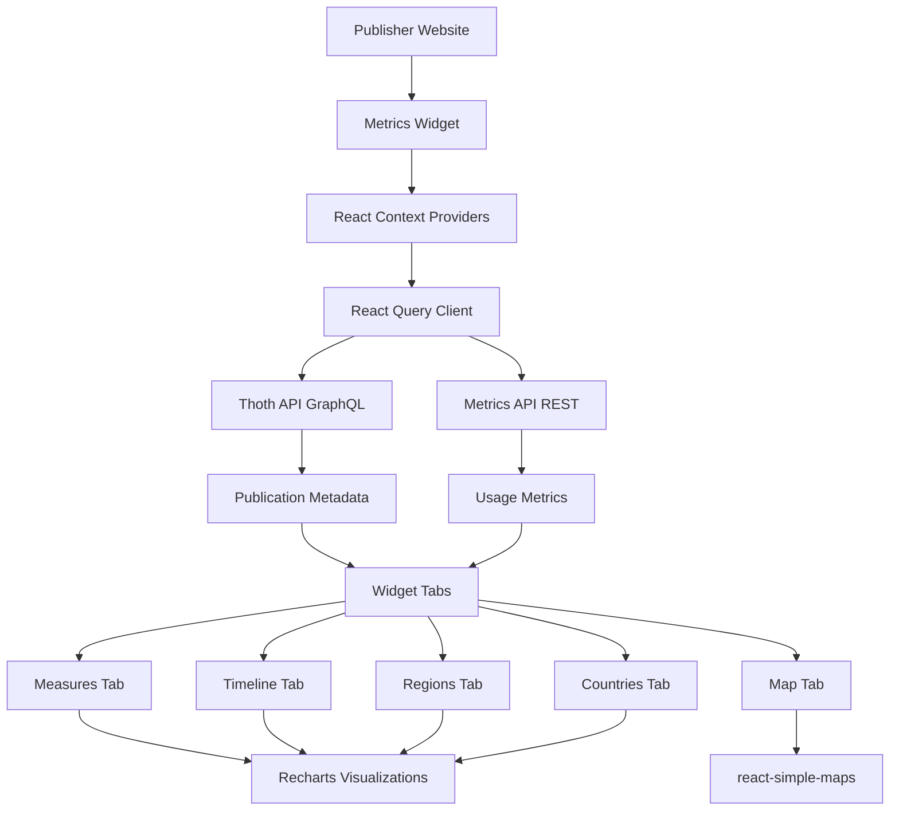

# Metrics Widget

A React-based widget for displaying publication metrics from multiple platforms. Designed for publishers to easily embed comprehensive usage statistics for their publications identified by DOI.

## Features

- 📊 **Multiple Visualization Tabs**: Measures, Timeline, Map, Regions, and Countries
- 🗺️ **Geographic Distribution**: Interactive world map showing global reach
- 📈 **Time-based Analytics**: Track metrics over time with customizable date ranges
- 🎨 **Fully Customizable**: Override styles via CSS custom properties or a typed `theme` prop
- 📱 **Responsive Design**: Works seamlessly on mobile, tablet, and desktop
- 🔌 **Easy Integration**: Works with React or JavaScript projects

## Installation

### For React Projects

```bash
npm install metrics-widget
```

### For Vanilla JavaScript Projects

#### Option 1: NPM Install (with bundler)

```bash
npm install metrics-widget
```

#### Option 2: CDN (no bundler required)

```html
<!-- CSS -->
<link rel="stylesheet" href="https://unpkg.com/metrics-widget@latest/dist/metrics-widget.css">

<!-- Import map for React dependencies -->
<script type="importmap">
  {
    "imports": {
      "react": "https://esm.sh/react@19",
      "react-dom": "https://esm.sh/react-dom@19",
      "react-dom/client": "https://esm.sh/react-dom@19/client",
      "react/jsx-runtime": "https://esm.sh/react@19/jsx-runtime"
    }
  }
</script>

<!-- Widget script -->
<script type="module">
  import { initMetricsWidget } from 'https://unpkg.com/metrics-widget@latest/dist/metrics-widget.js';
  // Use widget here
</script>
```

## Quick Start

### React Implementation

```tsx
import { MetricsWidget } from 'metrics-widget';
import 'metrics-widget/dist/metrics-widget.css';

function App() {
  return (
    <div>
      <h1>Publication Metrics</h1>
      <MetricsWidget doi="10.11647/OBP.0159" />
    </div>
  );
}

export default App;
```

### Vanilla JavaScript Implementation

#### With Bundler (Webpack, Vite, etc.)

```html
<!DOCTYPE html>
<html lang="en">
<head>
  <meta charset="UTF-8">
  <meta name="viewport" content="width=device-width, initial-scale=1.0">
  <title>Metrics Widget Demo</title>
  <link rel="stylesheet" href="node_modules/metrics-widget/dist/metrics-widget.css">
</head>
<body>
  <div id="metrics-container"></div>
  
  <script type="module">
    import { initMetricsWidget } from './node_modules/metrics-widget/dist/metrics-widget.js';
    
    // Initialize the widget
    const widget = initMetricsWidget('metrics-container', '10.11647/OBP.0159');
    
    // Cleanup when needed
    // widget.unmount();
  </script>
</body>
</html>
```

#### Without Bundler (CDN + Import Maps)

For environments without a build tool, use import maps to load React from CDN:

```html
<!DOCTYPE html>
<html lang="en">
<head>
  <meta charset="UTF-8">
  <meta name="viewport" content="width=device-width, initial-scale=1.0">
  <title>Metrics Widget Demo</title>
  
  <!-- Load the widget CSS -->
  <link rel="stylesheet" href="https://unpkg.com/metrics-widget@latest/dist/metrics-widget.css">
  
  <!-- Import map for React dependencies from CDN -->
  <script type="importmap">
    {
      "imports": {
        "react": "https://esm.sh/react@19",
        "react-dom": "https://esm.sh/react-dom@19",
        "react-dom/client": "https://esm.sh/react-dom@19/client",
        "react/jsx-runtime": "https://esm.sh/react@19/jsx-runtime"
      }
    }
  </script>
</head>
<body>
  <h1>Publication Metrics</h1>
  <div id="app"></div>
  
  <!-- Initialize widget using ES modules -->
  <script type="module">
    import { initMetricsWidget } from 'https://unpkg.com/metrics-widget@latest/dist/metrics-widget.js';
    
    // Initialize the widget
    const widget = initMetricsWidget('app', 'https://doi.org/10.11647/OBP.0159');
    
    console.log('Widget initialized:', widget);
    
    // Cleanup when needed
    // widget.unmount();
  </script>
</body>
</html>
```

**Note**: Import maps are supported in all modern browsers (Chrome 89+, Firefox 108+, Safari 16.4+, Edge 89+). For older browsers, use a bundler or polyfill.

## API Reference

### React Component

#### Props

```typescript
interface MetricsWidgetProps {
  doi: string;                      // DOI identifier (with or without https://doi.org/ prefix)
  theme?: MetricsWidgetTheme | null; // Optional runtime token overrides (see "Customization")
}
```

`MetricsWidgetTheme` is a typed `Partial<Record<MetricsWidgetTokenName, string>>` exported from the package; consumers get autocomplete for every `mw-*` token name and rejection of typos at compile time.

**Example DOI formats:**
- `"10.11647/OBP.0159"`
- `"https://doi.org/10.11647/OBP.0159"`

The component also self-wraps its required React Query / services / theming providers — render `<MetricsWidget>` directly without composing any extra context yourself.

### JavaScript API

#### `initMetricsWidget(containerId, doi, options?)`

Initializes the metrics widget in the specified container.

**Parameters:**
- `containerId` (string): The ID of the DOM element to render the widget in
- `doi` (string): The DOI identifier for the publication
- `options` (object, optional):
  - `theme?: MetricsWidgetTheme` — initial theme (same shape as the React `theme` prop)

**Returns:**
```typescript
interface MetricsWidgetInstance {
  unmount: () => void;                                       // remove the widget from the DOM
  setTheme: (theme: MetricsWidgetTheme | undefined) => void; // re-theme without remounting
}
```

**Example:**

```javascript
const widget = initMetricsWidget('app', '10.11647/OBP.0159', {
  theme: {
    'mw-color-background': '#1a1a1a',
    'mw-color-typography': '#f5f5f5',
  },
});

// Re-theme on the fly
widget.setTheme({ 'mw-color-background': '#fff' });

// Tear it down
widget.unmount();
```

## Environment Configuration

The widget connects to two APIs for fetching data. You can configure these endpoints using environment variables:

### Environment Variables

Create a `.env` file in your project root:

```env
VITE_THOTH_API_URL=https://api.thoth.pub/graphql
VITE_METRICS_API_URL=https://metrics-api.operas-eu.org
```

**Default values:**
- `VITE_THOTH_API_URL`: `https://api.thoth.pub/graphql` (publication metadata)
- `VITE_METRICS_API_URL`: `https://metrics-api.operas-eu.org` (usage metrics)

### Using with Different Build Tools

#### Vite

Create `.env` file in your project root (shown above). Vite automatically loads it.

#### Create React App

```env
REACT_APP_THOTH_API_URL=https://api.thoth.pub/graphql
REACT_APP_METRICS_API_URL=https://metrics-api.operas-eu.org
```

Note: You'll need to update the widget's config to read from `REACT_APP_*` instead of `VITE_*` variables.

#### Webpack

Use `webpack.DefinePlugin` or `dotenv-webpack`:

```javascript
// webpack.config.js
const webpack = require('webpack');

module.exports = {
  plugins: [
    new webpack.DefinePlugin({
      'import.meta.env.VITE_THOTH_API_URL': JSON.stringify(process.env.THOTH_API_URL),
      'import.meta.env.VITE_METRICS_API_URL': JSON.stringify(process.env.METRICS_API_URL)
    })
  ]
};
```

## Customization

The widget exposes its design tokens as CSS custom properties — every visible color and layout dimension is namespaced under `--mw-*` so the bundle never collides with the host page. There are two ways to override them; pick whichever fits your stack.

### Host-page isolation at a glance

- **Token namespace.** Every overridable token is prefixed `--mw-*`; you can't accidentally clobber a host token of the same name.
- **Cascade layer.** Bundled styles live inside `@layer metrics-widget`, so any consumer rule outside any layer wins regardless of source order.

### 1. CSS variable overrides (preferred for static themes)

Drop a `:root` block into any stylesheet. The widget's CSS lives inside `@layer metrics-widget`, so anything you write outside a layer wins automatically — no source-order gymnastics required.

```css
:root {
  /* Backgrounds & typography */
  --mw-color-background: #fff9e6;
  --mw-color-background-alt: #fffbf0;
  --mw-color-typography: #1a1a1a;

  /* Accents */
  --mw-color-active: hsl(284, 36%, 59%);
  --mw-color-border: hsl(284, 26%, 41%);
  --mw-ring: hsl(276, 26%, 50%);

  /* Per-platform chart colors */
  --mw-chart-metric-google-books: #ff8800;
  --mw-chart-metric-twitter: #1da1f2;

  /* Countries/Regions pie palette (darkest → lightest) */
  --mw-color-countries-1: hsl(284, 54%, 14%);
  --mw-color-countries-2: hsl(284, 36%, 28%);
  --mw-color-countries-3: hsl(284, 26%, 41%);
  /* ...through --mw-color-countries-11 */
}
```

> **Caveat.** Cascade layers don't beat host `!important`. If another stylesheet already uses `!important` on the same token, your override will need `!important` too.

### 2. React `theme` prop / vanilla JS option (preferred for dynamic themes)

Pass a JS object to `<MetricsWidget>` or `initMetricsWidget`. Useful when the parent app drives theming from state — for example a "brand mode" toggle. The keys are the token names without the leading `--`, and the type is exported as `MetricsWidgetTheme` for autocomplete and typo-protection.

```tsx
import {
  MetricsWidget,
  type MetricsWidgetTheme,
} from 'metrics-widget';
import 'metrics-widget/dist/metrics-widget.css';

const brandTheme: MetricsWidgetTheme = {
  'mw-color-background': '#1a1a1a',
  'mw-color-typography': '#f5f5f5',
  'mw-purple': 'hsl(280, 50%, 60%)',
  'mw-chart-metric-google-books': '#ff8800',
};

export default function App() {
  return <MetricsWidget doi="10.11647/OBP.0067" theme={brandTheme} />;
}
```

Vanilla JS:

```js
import { initMetricsWidget } from 'metrics-widget';

const widget = initMetricsWidget('metrics-container', '10.11647/OBP.0067', {
  theme: {
    'mw-color-background': '#1a1a1a',
    'mw-color-typography': '#f5f5f5',
  },
});

// Re-theme without remounting
widget.setTheme({ 'mw-color-background': '#fff' });

// Tear it down
widget.unmount();
```

The CSS-variable path and the JS-prop path can be combined: pass a `theme` prop for runtime/state-driven values, and use a `:root` block for static brand defaults.

### Theme prop behavior

A few rules govern how the `theme` prop is applied at runtime:

- **Merge, not replace.** Each new `theme` object merges into the previously applied set. Keys you omit from a subsequent update **keep their previously applied values** — they are not auto-reverted. To clear a single key, pass `undefined` for it (`theme={{ 'mw-color-background': undefined }}`); to clear everything, unmount the widget.
- **Color values are validated.** Color tokens (everything except layout dimensions, `mw-radius`, and `mw-tooltip-drop-shadow`) are validated before being applied. Accepted formats: named CSS colors (`red`, `rebeccapurple`), 3- or 6-digit hex (`#fff`, `#1a1a1a`), `rgb()` / `rgba()`, and `hsl()` / `hsla()`. Other formats — 4- or 8-digit hex (`#abcd`, `#1a1a1a80`), `oklch()`, `color()`, `lab()`, `lch()` — are not currently validated and will be rejected. Invalid values are silently dropped: the previously applied valid value (or bundle default) stays in place.
- **Non-color tokens are not validated.** Layout, radius, and shadow tokens accept any string and are written through as-is.
- **Cleanup on unmount.** Every key the widget ever wrote via the prop is removed from `document.documentElement.style` when the widget unmounts, so no overrides leak back to the host.
- **Hidden until applied.** On first mount the widget keeps its root `visibility: hidden` until tokens have been written to `document.documentElement`. The reveal happens before the first paint, so consumers passing a synchronous `theme` never see a flash of bundle defaults.

### Async theme loading

The hide-until-applied gate releases on the **first commit** after mount. If your theme is fetched asynchronously (API, `localStorage`, `matchMedia`, …), mount the widget conditionally so its first commit already carries the resolved theme:

```tsx
const theme = useResolvedTheme(); // returns undefined until ready

return theme ? <MetricsWidget doi={doi} theme={theme} /> : null;
```

Mounting with `theme={undefined}` and updating to `theme={resolved}` later will release the gate on the first commit with bundle defaults, then repaint when your theme arrives.

### Token catalog

All overridable tokens, grouped by tier:

```text
# Semantic
--mw-color-background, --mw-color-background-active, --mw-color-background-alt
--mw-color-typography, --mw-color-typography-alt
--mw-color-border, --mw-color-active, --mw-ring

# Components
--mw-color-nav-background, --mw-color-nav-background-active, --mw-color-nav-typography
--mw-color-header-background
--mw-color-button-background, --mw-color-button-typography, --mw-color-button-border
--mw-color-button-typography-hover, --mw-color-button-border-hover
--mw-color-button-typography-active, --mw-color-button-border-active
--mw-color-button-active-background, --mw-color-button-active-typography, --mw-color-button-active-border
--mw-color-input-background, --mw-color-input-border, --mw-color-input-typography
--mw-color-select-background-selected, --mw-color-input-start-icon
--mw-color-tooltip-background, --mw-tooltip-drop-shadow
--mw-color-divider, --mw-color-spinner
--mw-chart-legend-background
--mw-color-placeholder-icon, --mw-color-placeholder-icon-bg

# shadcn-derived (ui primitives)
--mw-radius
--mw-background, --mw-foreground
--mw-popover, --mw-popover-foreground
--mw-primary, --mw-primary-foreground
--mw-secondary, --mw-secondary-foreground
--mw-muted, --mw-muted-foreground
--mw-destructive, --mw-border

# Layout
--mw-max-width, --mw-max-height
--mw-header-height, --mw-footer-height, --mw-content-height

# Countries/Regions pie palette
--mw-color-countries-1 ... --mw-color-countries-11

# Per-platform chart palette
--mw-chart-metric-default
--mw-chart-metric-the-classics-library, --mw-chart-metric-google-books
--mw-chart-metric-open-book-publishers
--mw-chart-metric-open-book-publishers-html-reader
--mw-chart-metric-open-book-publishers-pdf-reader
--mw-chart-metric-open-edition, --mw-chart-metric-oapen
--mw-chart-metric-twitter, --mw-chart-metric-wikimedia, --mw-chart-metric-wikipedia
--mw-chart-metric-wordpress-com, --mw-chart-metric-world-reader
--mw-chart-metric-crossref

# Map gradient
--mw-chart-map-zero, --mw-chart-map-lowest, --mw-chart-map-highest
```

## Widget Features

The widget provides five comprehensive tabs for analyzing publication metrics:

### 1. 📊 Measures Tab

Displays overall metrics broken down by:
- **Platform**: Usage across different platforms (OAPEN, OpenEdition, JSTOR, etc.)
- **Book-level metrics**: Total views, downloads, and sessions
- **Chapter-level metrics**: Individual chapter performance with filtering options

Features:
- Filter by specific platforms
- Search and filter chapters
- Download data as CSV
- Interactive pie charts with detailed breakdowns

### 2. 📈 Timeline Tab

Visualizes metrics over time:
- Monthly aggregated data
- Multiple metrics displayed simultaneously
- Year-based pagination for large datasets
- Interactive legend to toggle metric visibility

Perfect for:
- Tracking growth trends
- Identifying seasonal patterns
- Comparing platform performance over time

### 3. 🗺️ Map Tab

Interactive world map visualization:
- Geographic distribution of usage
- Color-coded countries by metric intensity
- Hover tooltips with detailed country statistics
- Zoom and pan functionality

Helps identify:
- Geographic reach of publications
- Regional popularity
- International adoption

### 4. 🌍 Regions Tab

Continental-level breakdown:
- Pie chart visualization of regional distribution
- Percentage-based comparisons
- Sortable region list
- CSV export capability

Regions include:
- Africa, Americas, Asia, Europe, Oceania
- Antarctic (if applicable)

### 5. 🌐 Countries Tab

Detailed country-level analytics:
- Top countries ranked by usage
- Percentage distribution
- Interactive pie chart
- Sortable country list with percentages
- CSV download option

Shows top 10 countries by default (configurable).

## Architecture



### Data Flow

1. **Initialization**: Widget receives DOI prop
2. **Validation**: DOI is validated using `doi-utils` library
3. **Metadata Fetch**: Publication metadata retrieved from Thoth API
4. **Metrics Fetch**: Usage metrics fetched from Metrics API
5. **Processing**: Data is transformed and aggregated
6. **Visualization**: Charts and maps render the processed data


## Tracked Platforms

The widget tracks metrics from the following platforms:

- Google Books
- Open Book Publishers (HTML/PDF readers)
- OpenEdition
- OAPEN
- World Reader
- JSTOR
- The Classics Library
- Unglue.it
- OpenAIRE
- Wikimedia/Wikipedia
- Figshare
- SUB Göttingen
- EKT (National Documentation Centre)
- UPLO
- WordPress.com references

## Development

### Prerequisites

- Node.js 18+ and npm
- React 19+ (peer dependency)

### Setup

```bash
# Clone the repository
git clone https://github.com/thoth-pub/metrics-widget.git
cd metrics-widget

# Install dependencies
npm install

# Create environment file
cp .env.example .env

# Start development server
npm run dev
```

### Build

```bash
# Production build
npm run build

# Preview build
npm run preview
```
